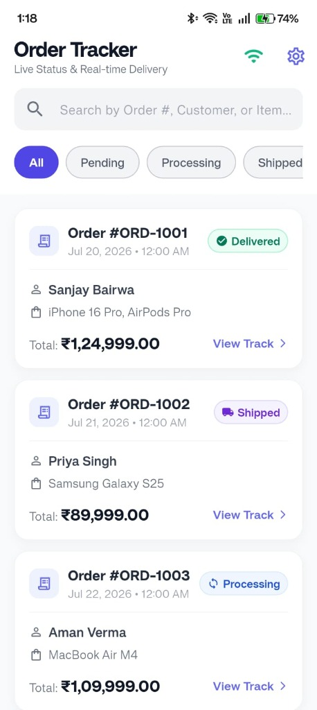
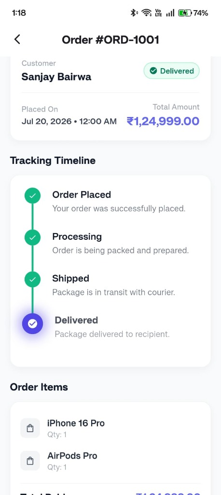

# 📦 Order Tracker Application

A modern, production-ready **Flutter** order tracking application powered by **Flutter Riverpod** state management and RESTful Mock API integration. Features real-time order status tracking, fluid vertical timeline animations, custom status chips, local offline caching, and seamless network reconnection handling.

---

## 📱 Application Screenshots & Media Assets

| **Screen 1: Live Order List** | **Screen 2: Tracking Timeline** |
| :---: | :---: |
|  |  |

### 📂 Screenshot Asset Locations in Repository:
- **Screen 1 (Order List View)**: [`docs/screenshots/order_list.jpg`](docs/screenshots/order_list.jpg)
- **Screen 2 (Tracking Timeline View)**: [`docs/screenshots/order_detail.jpg`](docs/screenshots/order_detail.jpg)

---

## 🌟 Key Features

* **Screen 1: Live Order Management**
  * Fetches real-time orders from Mock API via Dio HTTP client.
  * Dynamic Order ID formatting (`ORD-1001`, `ORD-1002`, etc.).
  * Indian Currency formatting in Rupees (`₹1,24,999.00`).
  * Pull-to-refresh (`RefreshIndicator`) for manual synchronization.
  * Search field with **350ms Debounce** typing protection.
  * Filter orders by status chips (*Pending*, *Processing*, *Shipped*, *Delivered*, *Cancelled*).
  * Staggered list entrance animations.

* **Screen 2: Order Detail & Timeline Progression**
  * Shared-element `Hero` animations between screens.
  * Interactive **Vertical Status Timeline** featuring continuous line fill progress and live status pulsing beacon rings.
  * Inactive greyed-out stages for future delivery steps.
  * Detailed breakdown of customer overview, itemized prices, total amount paid in Rupees (`₹`), and footer credits.

* **Appearance & Settings**
  * **Light / Dark Mode**: Full Material 3 theme switching support via Riverpod `themeModeProvider`.
  * **Settings Screen**: Dedicated screen to switch theme modes and configure custom Mock API base URLs.

* **Offline Resiliency & Error Handling**
  * Automatic local caching in `SharedPreferences` for offline fallback.
  * Top Amber banner indicating offline cached view with sync timestamp.
  * Automatic reconnection listener displaying a green confirmation toast when internet returns.
  * Interactive AppBar **Wifi Toggle** (`📶`) to simulate and test offline and error states in real-time.

---

## 📁 Project Architecture

```
lib/
├── core/                  # Design system, ApiConstants & utilities
├── models/                # Order and OrderItem data models & JSON parsing
├── providers/             # Riverpod OrderNotifier & ThemeModeNotifier state management
├── repository/            # OrderRepository abstraction layer
├── screens/               # OrderListScreen, OrderDetailScreen, & SettingsScreen
├── services/              # ApiService with Dio & SharedPreferences offline caching
└── widgets/               # OrderCard, StatusChip, VerticalTimeline, FooterCredit
```

---

## 🚀 Getting Started

### Prerequisites
* **Flutter SDK**: `^3.12.0` or higher
* **Dart SDK**: `^3.12.0`

### Installation & Execution

```bash
# 1. Clone repository
git clone https://github.com/sanjayBairw/ordertracker.git

# 2. Navigate to directory
cd ordertracker

# 3. Install dependencies
flutter pub get

# 4. Run application
flutter run
```

---

## 🧪 Automated Testing

The project includes 15 unit and widget tests covering data models, Riverpod state providers, and component rendering:

```bash
# Run all unit and widget tests
flutter test
```

### Test Suites Overview
* `test/models/order_test.dart`: Model deserialization, Indian Rupee formatting, & status normalization.
* `test/providers/order_provider_test.dart`: Filtering, searching, simulated error state, and Riverpod provider logic.
* `test/widgets/order_card_test.dart`: OrderCard rendering, `ORD-1001` format, `₹` currency, & tap callbacks.
* `test/widgets/status_chip_test.dart`: Rendering and color configuration for all status chips.
* `test/widgets/vertical_timeline_test.dart`: Vertical timeline progression & cancelled status views.
* `test/widget_test.dart`: Full application smoke test.

---


> ## 🤖 AI Usage Note

This project was developed with assistance from AI tools (including ChatGPT and Google Gemini) for architecture planning, debugging, UI refinement, documentation, and code suggestions. All AI-generated code and recommendations were manually reviewed, modified, tested, and integrated before submission.
>
> **Scope of AI Utilization:**
> 1. **Architecture & State Management**: Designing decoupled repository patterns and Riverpod `NotifierProvider` state structures.
> 2. **UI & Animations**: Crafting custom `CurvedAnimation` fluid vertical progress line sweeps, pulsing active beacon glows, and shared-element `Hero` transitions.
> 3. **Offline & Error Resilience**: Implementing `SharedPreferences` local caching, automatic reconnection listeners, and simulated offline toggles.
> 4. **Testing Suite**: Generating unit and widget test coverage for state management and UI components.
>
> All AI-generated suggestions were reviewed, validated with `flutter analyze` and `flutter test`, and refined for quality.

---

## 🎥 Loom Video Walkthrough Script

### **Demo Recording Guide (~60-90s)**

1. **Screen 1 Overview (0:00 - 0:20)**: Show live order list, perform pull-to-refresh, filter by status chips (*Pending*, *Shipped*, etc.), and use search bar.
2. **Screen 2 Timeline Animation (0:20 - 0:45)**: Tap an order to demonstrate `Hero` transition, animated line progress fill, and active beacon glow.
3. **Offline & Error State (0:45 - 1:10)**: Tap the AppBar Wifi icon (`📶`) to simulate offline mode, highlighting the top amber banner and cached data responsiveness.
4. **Reconnection (1:10 - 1:30)**: Tap Wifi icon again to reconnect, showcasing the green *"Back Online!"* toast notification.
